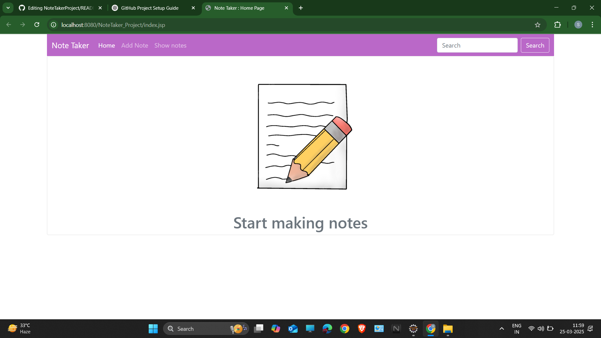
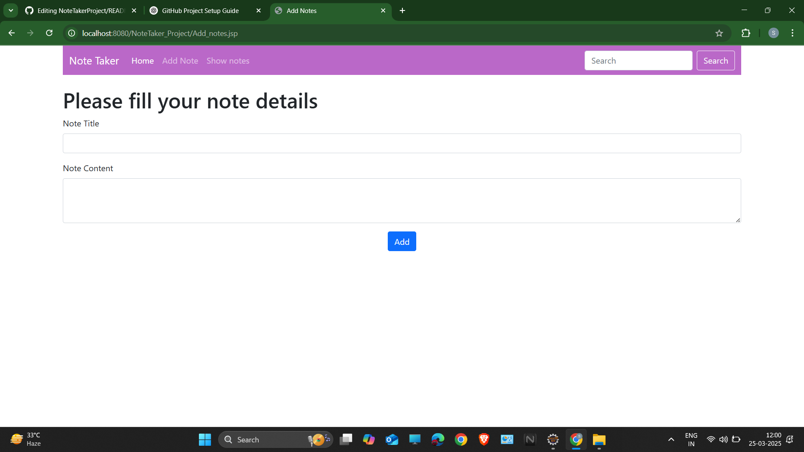

# 📝 NoteTaker Project

## 📖 Overview
NoteTaker is a web-based application that allows users to create, update, view, and delete notes. It is built using **Java, JSP, Servlets, Hibernate**, and follows the **MVC architecture**.

## 🚀 Features
- Create, edit, delete, and view notes 📝  
- Uses Hibernate for database interaction 🗄️  
- JSP and Servlets for dynamic web pages 🌐  
- Simple and responsive UI using CSS 🎨  

## ⚙️ Technologies Used
- **Java** (JDK 8 or higher)  
- **JSP & Servlets** (for handling UI and backend logic)  
- **Hibernate** (for ORM and database handling)  
- **MySQL** (as the database)  
- **CSS** (for styling)  
- **Maven** (for dependency management)  

## 📸 Screenshots
- 🏠 Home Page

- ➕ Add Note Page

